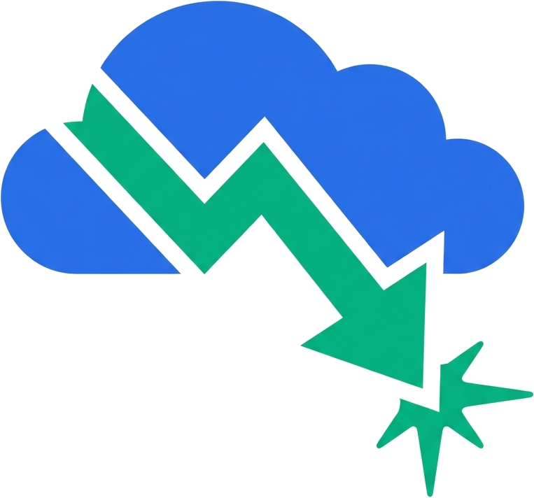

<p align="center">
  
</p>

<p align="center">
  <a href="https://dautovri.github.io/cloud-cost-agent/"><strong>Website</strong></a>
  ·
  <a href="skills/cloud-cost-agent/SKILL.md">SKILL.md</a>
  ·
  <a href="PRODUCT.md">Product</a>
</p>

# cloud-cost-agent

Native-first FinOps agent skill for **AWS, GCP, and Azure**. Find real cloud savings from inside your AI coding agent (Claude Code, Cursor, Gemini CLI, etc.) — using each provider's own CLIs and recommendation engines. No new dashboard, no data ingestion.

🌐 **[dautovri.github.io/cloud-cost-agent](https://dautovri.github.io/cloud-cost-agent/)**

## Install

### Claude Code (recommended)

It's a Claude Code plugin — install it from the marketplace:

```
/plugin marketplace add dautovri/cloud-cost-agent
/plugin install cloud-cost-agent
```

The `cloud-cost-agent` skill is then available automatically whenever you talk about cloud cost.

### Any agent via `npx skills` (Cursor, Codex, Gemini, Copilot + 70 more)

Installs the skill into whichever agent you point it at — works with the [skills.sh](https://skills.sh) ecosystem:

```bash
npx skills add dautovri/cloud-cost-agent --agent claude-code
```

Run `npx skills find "cloud cost"` to discover it in the directory.

### Or the bundled installer

One command — auto-detects your agent and copies the skill into place:

```bash
curl -sL https://raw.githubusercontent.com/dautovri/cloud-cost-agent/main/install.sh | bash
```

Or from a clone (`--tool claude|cursor|gemini` to override detection):

```bash
git clone https://github.com/dautovri/cloud-cost-agent
cd cloud-cost-agent && ./install.sh
```

## Try it

1. Authenticate to the clouds you use: `aws sso login`, `gcloud auth login`, `az login`.
2. Ask your agent:

```
/cloud-cost-agent audit my AWS spend last 30 days
/cloud-cost-agent find quick wins on GCP and Azure
/cloud-cost-agent rightsizing recommendations --provider all
```

The skill picks the right native commands per provider and returns a prioritized savings list (by $ impact + effort) with concrete next steps.

## What it uses

| Provider | Native surfaces |
|----------|-----------------|
| **AWS**   | `aws ce`, `aws compute-optimizer`, `aws cost-optimization-hub` |
| **GCP**   | `gcloud recommender` (machine type, idle, CUDs), BigQuery billing export |
| **Azure** | `az advisor --category Cost`, `az costmanagement`, `az consumption` |

Covers cost breakdowns, rightsizing, idle-resource cleanup, and commitment/reservation recommendations.

## Safe by default

Read-only first. Explicit confirmation before any change (delete, resize, purchase). See [SKILL.md](./skills/cloud-cost-agent/SKILL.md) for the full playbook and [docs/](./skills/cloud-cost-agent/docs/) for per-provider setup and IAM.

## More

- [SKILL.md](./skills/cloud-cost-agent/SKILL.md) — the skill itself (commands, safety rules, audit flow)
- [PRODUCT.md](./PRODUCT.md) — product vision and roadmap
- Contributions and issues welcome.
